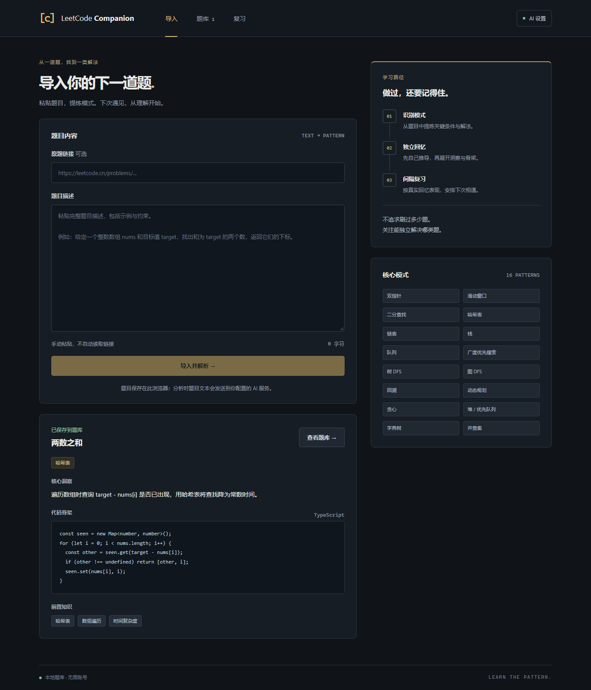
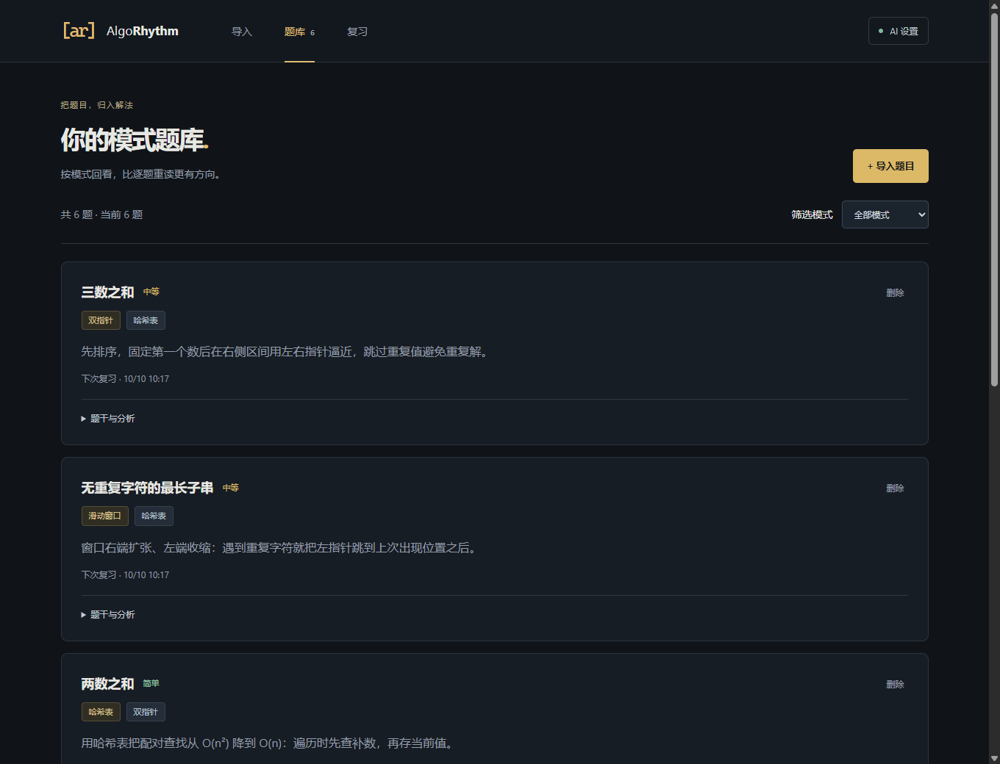
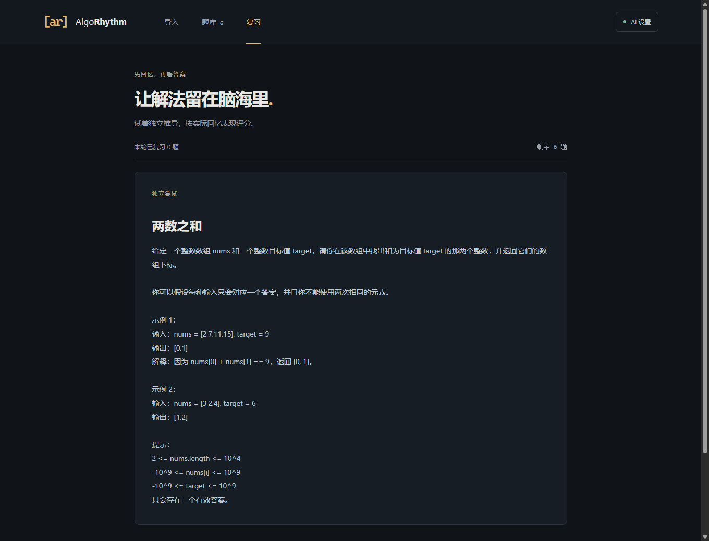
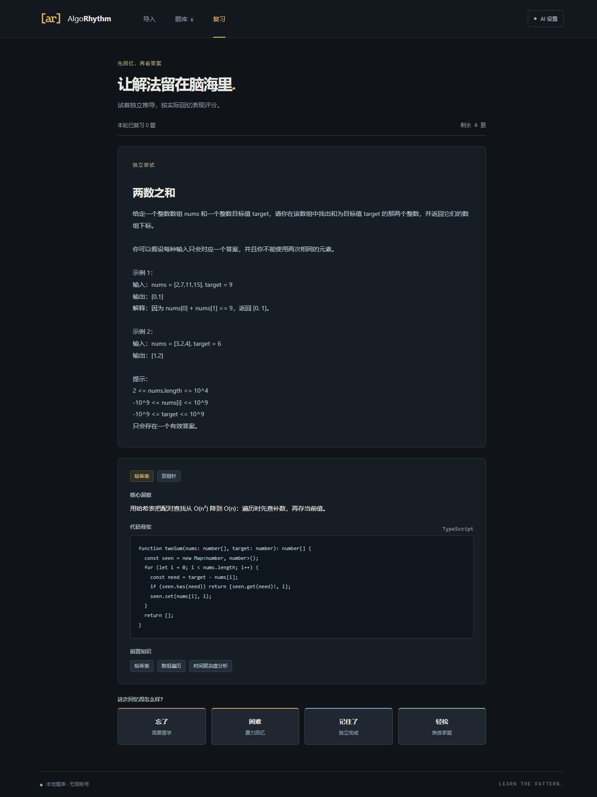

# AlgoRhythm

[](LICENSE)
[](package.json)
[](https://react.dev/)
[](https://www.typescriptlang.org/)
[](https://vite.dev/)
[](https://tailwindcss.com/)
[](https://github.com/open-spaced-repetition/ts-fsrs)

> **AlgoRhythm** 是一款开源的算法学习伴侣。它通过 AI 将题目归类到 16 种核心模式，并结合 FSRS 间隔重复算法，帮你掌握解题的“节奏”，真正摆脱“刷完就忘”。

*Find your rhythm in algorithms.* 名字读作 Algo-Rhythm（Algorithm + Rhythm）；搜索项目时注意拼写不是 AlgoRythm。

纯前端、本地运行。粘贴题目 → AI 提炼模式与解法 → 存入本地题库 → 主动回忆 → FSRS 安排下次复习。

## 快速开始

需要 Node.js 22.13+（22.x）、24.x 或 26+。仓库公开，直接克隆即可。

```sh
git clone https://github.com/harbinresearcher/algorhythm.git
cd algorhythm
npm install && npm run dev
```

打开 http://127.0.0.1:5173。端口固定为 5173；已占用时先关闭旧服务，避免更换地址后看不到原来的本地题库。

```sh
npm test
npm run build
npm run preview
```

`preview` 预览构建产物，访问地址和开发服务器不同，浏览器存储也不同。

## 使用

1. 打开“AI 设置”，填写自己的 API Key、Base URL 和 Model。
2. 粘贴原题链接，或填写完整题干（包括示例与约束）。链接先经 Jina Reader 读取，再交给模型分析。
3. 导入后在题库按主要或次要模式筛选，展开题干与分析。
4. 进入复习，先独立推导，再展开洞察、骨架和前置知识。
5. 按真实表现选择“忘了 / 困难 / 记住了 / 轻松”。保存后移出本轮队列，更新下次复习时间。

FSRS 使用默认参数并开启 fuzz。“忘了”可能几分钟后再次到期，重新加载队列即可查看；没有硬编码 3 天或 1 周的日程。

## AI 配置

默认 Base URL 为 `https://api.deepseek.com`，Model 为 `deepseek-flash`。

配置示例（Key 均需自行申请，模型以账号可用列表为准）：

```text
DeepSeek
  Base URL: https://api.deepseek.com
  Model:    deepseek-flash
  API Key:  你的 DeepSeek API Key

OpenAI
  Base URL: https://api.openai.com/v1
  Model:    gpt-6-luna
  API Key:  你的 OpenAI API Key
```

> **模型名会过时，配置前先查服务商当前文档。** 例如 DeepSeek 已于 2026-07-24 停用
> `deepseek-chat` 与 `deepseek-reasoner`，现在应使用 `deepseek-flash`（默认）或 `deepseek-v4-pro`。
> 填了已下线的模型名，接口会直接报错。

参考：[DeepSeek API](https://api-docs.deepseek.com/)、[OpenAI 模型文档](https://developers.openai.com/api/docs/models/gpt-6-luna)。

支持 OpenAI 风格的 `/chat/completions` 服务。Base URL 填 API 根地址，不含 `/chat/completions`。模型必须支持 JSON 输出，服务必须允许浏览器跨域调用。远程服务使用 HTTPS，本机服务允许 HTTP。

Key 保存在此浏览器的 localStorage 中，不会写入仓库，也未加密。请用自己的 Key，避免共享机器和不可信页面脚本。分析时题目文本会发送到你配置的 AI 服务。

HTTP 401 检查 Key，429 检查额度，400 检查模型和 JSON 输出支持。网络/CORS 错误需检查地址及服务端跨域配置。超时为 60 秒，不自动重试付费调用。

AI 只允许预定义的 16 种模式。无法解析的 JSON 不入库；字段缺失使用默认内容并展示警告。非法主要模式显示分类待确认提示，兜底标签不能视为可信分类。

## 本地数据

题目和卡片保存在 IndexedDB，刷新不会丢失。不同浏览器、配置文件和访问地址各自保存独立数据。清除站点数据会删除题库；当前没有云同步或导出功能。

## 运行截图

截图来自隔离浏览器，使用示例题和模拟 AI 响应，不代表真实服务分类验收。

### 导入



### 题库



### 复习





移动端：[mobile.png](docs/screenshots/mobile.png)。

## 结构

- `src/ai.ts`：Prompt、请求、字段校验与本地配置。
- `src/db.ts`：Dexie CRUD、到期索引和评分事务。
- `src/fsrs.ts`：默认 FSRS 初始化与排期，不依赖 React。
- `src/patterns.ts`：固定 16 种模式。
- `src/pages/`：导入、题库、复习。
- `tests/core.test.ts`：AI 边界、IndexedDB 与 FSRS 一致性。

技术栈：React 18、TypeScript、Vite 6、Tailwind 4、Dexie、dexie-react-hooks、ts-fsrs。版本由 lockfile 固定。旧 Tailwind 和 Vitest 已升级，原因见 [实现记录](docs/implementation.md)。

## Agent 接手

先读 [当前进度](docs/STATUS.md) 与 [路线图](docs/ROADMAP.md)，再按需读 [架构](docs/ARCHITECTURE.md)、[项目背景](docs/project-context.md)、[原始阶段方案](docs/phase-1-plan.md)、[实现修正](docs/implementation.md) 和 [详细交接](docs/HANDOFF.md)。Agent 遵守 [协作约束](AGENTS.md)，每次工作结束必须更新 STATUS.md。

提交前运行 `npm run lint`、`npm run format:check`、`npm test`、`npm run build`。开发与 PR 流程见 [CONTRIBUTING.md](CONTRIBUTING.md)，不要提交 Key、个人题库、浏览器配置或缓存。

第一阶段不做后端、账号、浏览器扩展、代码编辑器、掌握度图表或面试模拟。后续任务见 [ROADMAP.md](docs/ROADMAP.md)。

仓库已公开并启用 `main` 分支保护：改动通过 PR 合入，请勿直接推送。CI（lint + test + build）待有实际协作需求后再加。

## 贡献与支持

- 开发环境、代码规范与 PR 流程：[CONTRIBUTING.md](CONTRIBUTING.md)
- 社区行为规范：[CODE_OF_CONDUCT.md](CODE_OF_CONDUCT.md)
- 提问、报 Bug 与功能建议：[SUPPORT.md](SUPPORT.md)
- 版本变更历史：[CHANGELOG.md](CHANGELOG.md)
- 报告安全漏洞：**请勿使用公开 Issue**，见 [SECURITY.md](SECURITY.md)

请勿在提交中包含 API Key、个人题库或浏览器配置。[推送保护](https://docs.github.com/code-security/secret-scanning/about-push-protection) 会在检测到疑似密钥时直接拒绝推送；遇到拦截请移除密钥并到服务商处轮换，不要绕过。


## License

[MIT](LICENSE)，Copyright © 2026 harbinresearcher。


## 10 月 9 日导入修复

原题链接与题目描述二选一。有链接时，浏览器先通过 [Jina Reader](https://jina.ai/reader/) 获取公开网页正文，再发送到配置的 AI 服务；API Key 不发送给 Reader。网页可能受登录、反爬、网络和 Reader 限流影响，读取失败会提示，请清空链接后粘贴完整题干。模型必须明确确认完整算法题，拒绝无关内容；失败不会保存题目。导入成功和错误均显示可关闭的醒目浮层。此需求覆盖早期“不读取链接”的范围约定。
